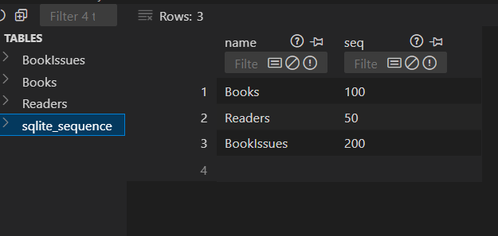
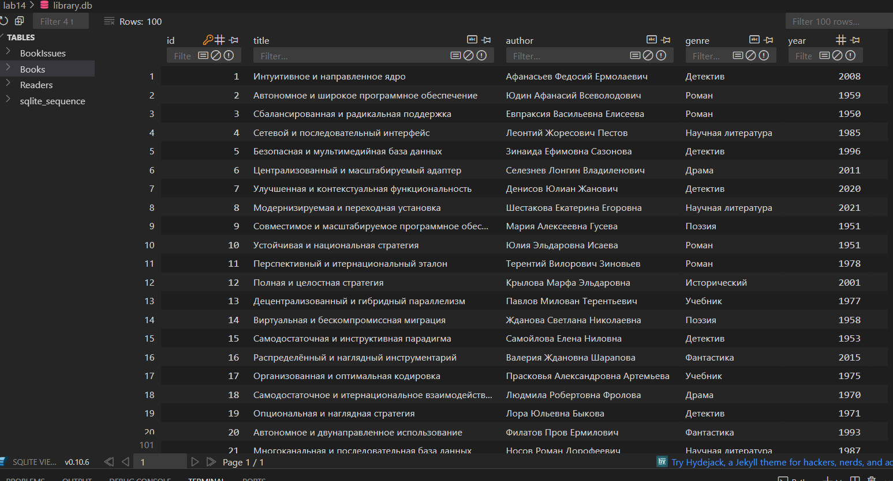
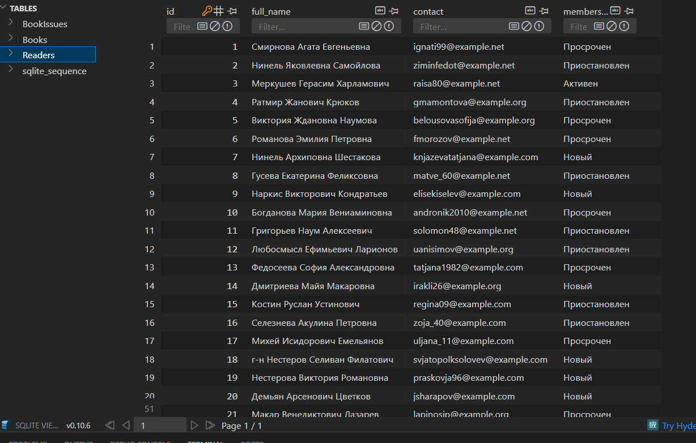
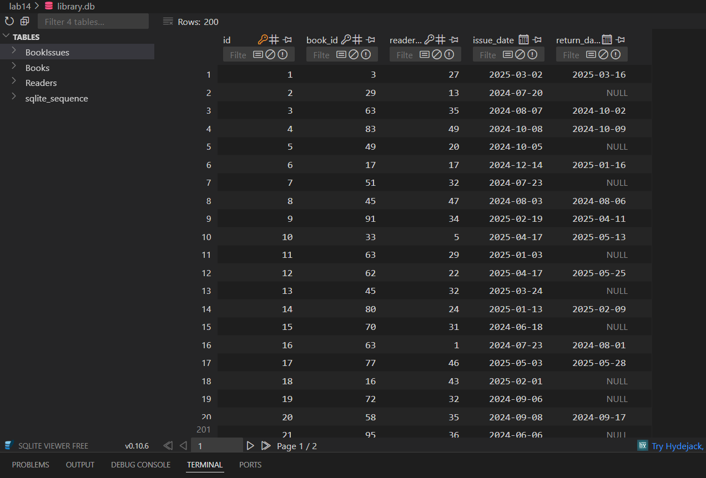
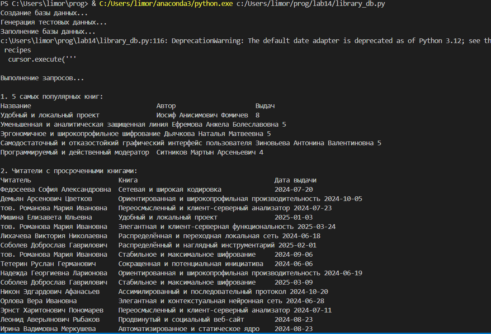
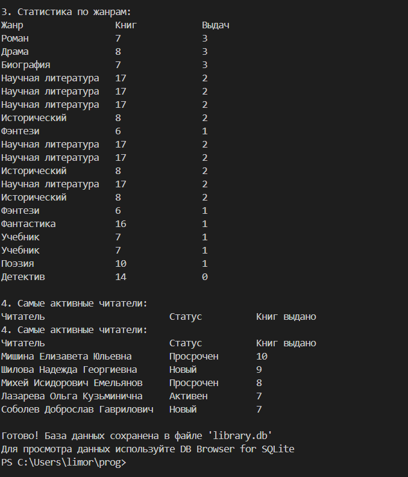

# Отчёт по проекту: База данных библиотеки

## Условия задачи

Требовалось создать базу данных библиотеки со следующими компонентами:
1. Таблица "Книги":
   - Название, автор, жанр, год издания
2. Таблица "Читатели":
   - ФИО, контактные данные, членский статус
3. Таблица "Выдачи книг":
   - Связь книга-читатель, даты выдачи и возврата

Задачи:
1. Спроектировать БД с использованием crow's foot notation
2. Создать таблицы и заполнить тестовыми данными
3. Реализовать запросы для выборки данных
4. Оформить отчёт с описанием, скриншотами и ссылками

## Описание проделанной работы

### 1. Проектирование базы данных
Использована нотация crow's foot для представления отношений:
- Один читатель может брать много книг
- Одна книга может быть выдана многим читателям (в разное время)

### 2. Генерация данных
Для заполнения базы использована библиотека Faker:
- Сгенерировано 100 книг (20+ жанров)
- Создано 50 читателей с разными статусами
- Добавлено 200 записей о выдачах книг
- 30% книг имеют статус "не возвращено"

### 3. Реализованные запросы
1. Топ-5 популярных книг
2. Читатели с просроченными книгами
3. Статистика по жанрам
4. Самые активные читатели
   
## Скриншоты результатов

### 1. Структура базы данных

### 2. Пример данных в таблице Books

### 3. Пример данных в таблице Readers

### 4. Пример данных о выдачах книг

### 5. Результаты запросов в консоли

## Используемые материалы

1. Библиотеки:
   - SQLite3:
   - Faker: генерация тестовых данных

2. Инструменты:
   - DB Browser for SQLite: просмотр БД

3. Ресурсы:
   - [Документация по нотации Crow's Foot:](https://www.lucidchart.com/pages/er-diagrams)
   - [SQLite Tutorial:](https://www.sqlitetutorial.net/)
   - [Примеры SQL-запросов:](https://www.w3schools.com/sql/)