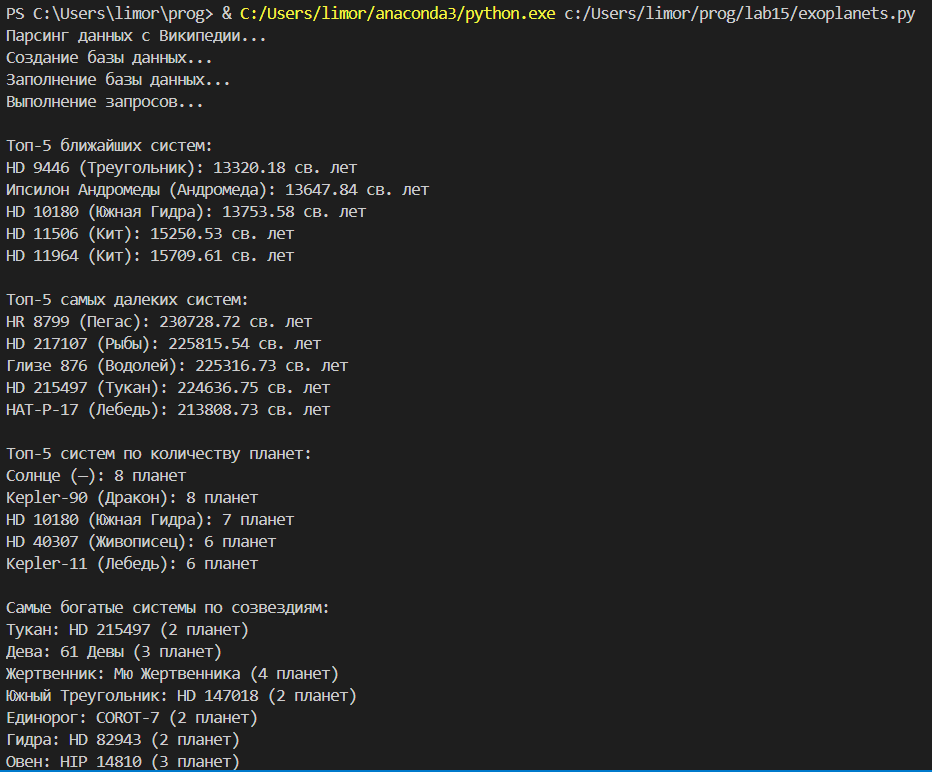
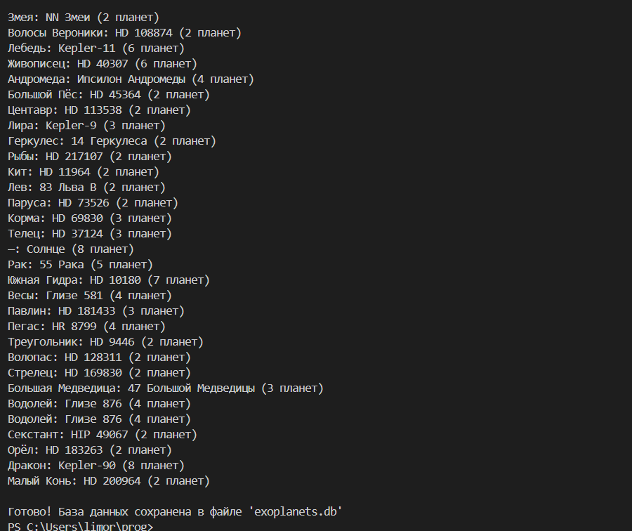
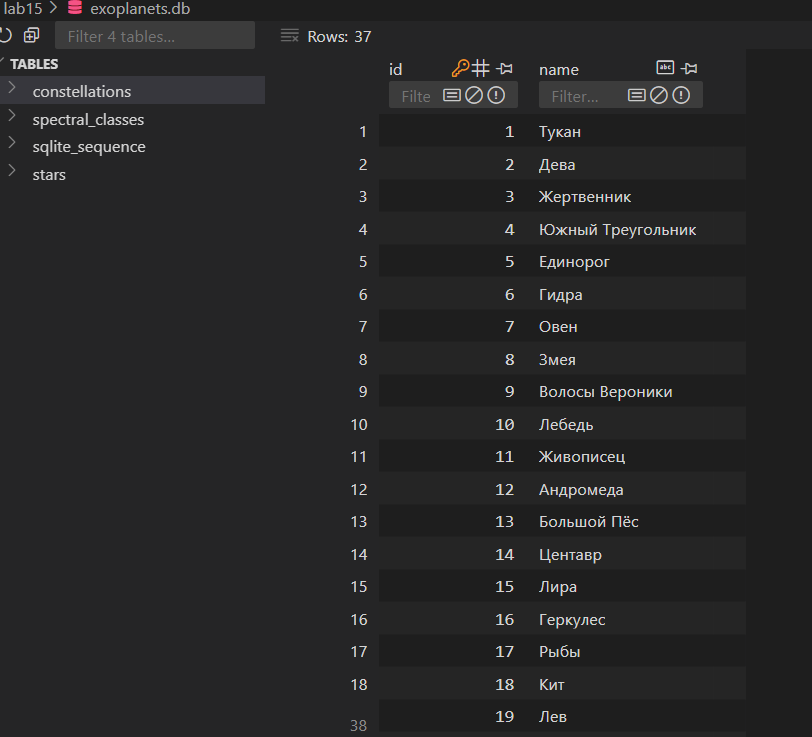
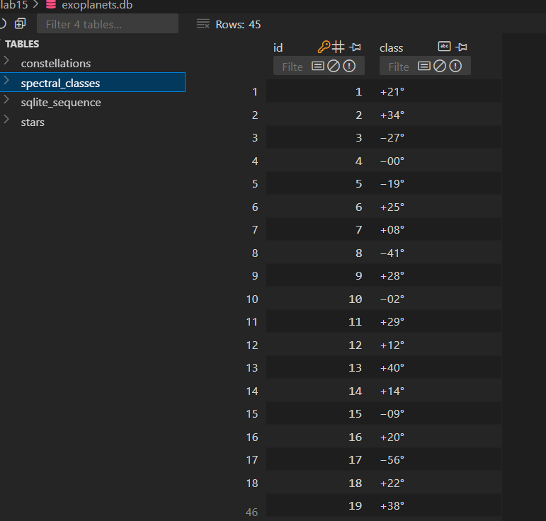
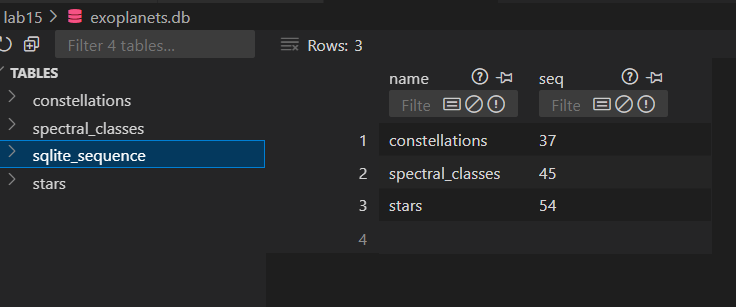
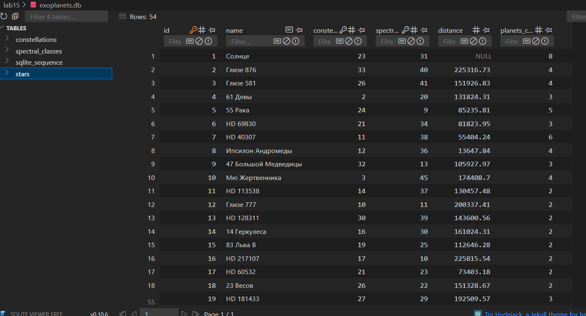

# Отчёт по проекту: Список кратных планетных систем

## Условия задачи
Проект включает следующие этапы:
1. Проектирование БД с использованием crow's foot notation
2. Реализация парсера для сбора данных с веб-страницы
3. Создание таблиц БД и заполнение их данными через DB API
4. Написание SQL-запросов для выборки данных

Требуемые таблицы:
- Звёзды (stars)
- Созвездия (constellations)
- Спектральные классы (spectral_classes)

Необходимые запросы:
1. N самых близких/далёких систем
2. N систем с самым большим числом планет
3. Системы с самым большим числом планет с группировкой по созвездиям

## Описание проделанной работы
### 1. Проектирование базы данных
Использована нотация crow's foot для представления отношений между таблицами:

constellations (1) ────< stars (*)
spectral_classes (1) ───< stars (*)
Структура таблиц:
- constellations (созвездия)
  - id - первичный ключ (INTEGER)
  - name - название созвездия (TEXT, UNIQUE)
- spectral_classes (спектральные классы)
  - id - первичный ключ (INTEGER)
  - class - обозначение класса (TEXT, UNIQUE)
- stars (звёзды)
  - id - первичный ключ (INTEGER)
  - name - название звезды (TEXT)
  - constellation_id - внешний ключ к constellations (INTEGER)
  - spectral_class_id - внешний ключ к spectral_classes (INTEGER)
  - distance - расстояние в световых годах (REAL)
  - planets_count - количество планет (INTEGER)

### 2. Реализация парсера
Разработан парсер для извлечения данных из таблицы Википедии. Особенности реализации:
- Обработка нестандартных форматов данных (например, "7 (9?)" для количества планет)
- Очистка числовых значений от посторонних символов
- Извлечение только первой части спектрального класса
- Обработка отсутствующих значений расстояния

### 3. Создание и заполнение БД
Реализовано с использованием SQLite и Python DB API:
- Автоматическое создание таблиц при запуске
- Обработка уникальных значений для созвездий и спектральных классов
- Установка связей между таблицами через внешние ключи
- Пакетная вставка данных

### 4. Реализация SQL-запросов
Выполнены все требуемые запросы:
1. N самых близких/далёких систем
2. N систем с максимальным количеством планет
3. Системы с максимальным количеством планет по созвездиям

### 5. Запуск проекта
Для выполнения проекта:
1. Установить зависимости: pip install requests beautifulsoup4
2. Запустить скрипт: python exoplanets.py

Скрипт выполняет:
- Парсинг данных с Википедии
- Создание БД SQLite (exoplanets.db)
- Заполнение таблиц
- Выполнение запросов с выводом результатов в консоль

## Скриншоты результатов

## Используемые материалы

1. Источник данных:  
   [Википедия - Список кратных планетных систем](https://ru.wikipedia.org/wiki/Список_кратных_планетных_систем)

2. Технологии:
   - Python 3.10
   - SQLite
   - BeautifulSoup4 (парсинг HTML)
   - Requests (HTTP-запросы)
   
3. Инструменты для работы с БД:
   - [DB Browser for SQLite: ](https://sqlitebrowser.org/)
   - [SQLite CLI: ](https://sqlite.org/cli.html)

4. Дополнительные ресурсы:
   - [Документация по нотации Crow's Foot: ](https://www.lucidchart.com/pages/er-diagrams#section_5)
   - [Руководство по Beautiful Soup: ](https://www.crummy.com/software/BeautifulSoup/bs4/doc/)
   - [SQLite Python документация: ](https://docs.python.org/3/library/sqlite3.html)
