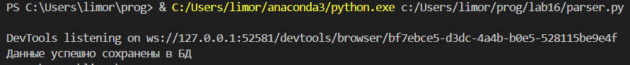
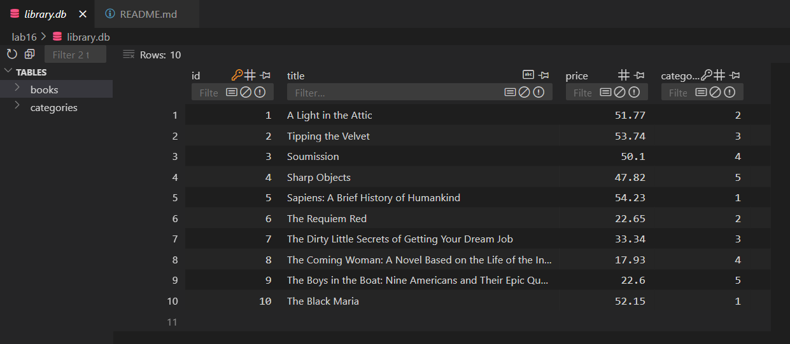
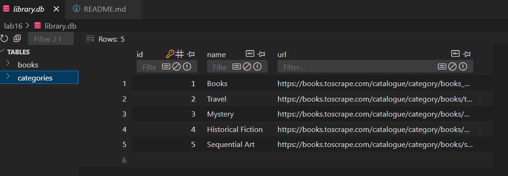
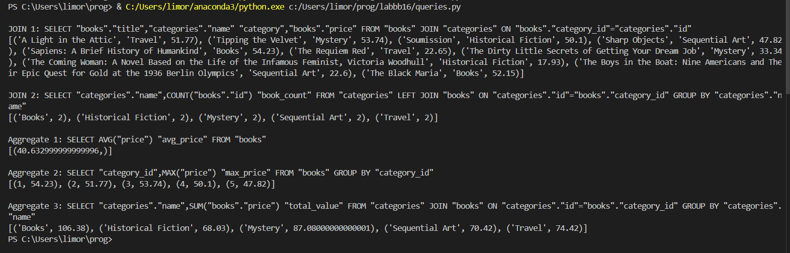

# Отчёт по заданию

## Условия задачи

1. Реализовать парсер с использованием Selenium для сбора данных с веб-страницы (онлайн-каталог, интернет-магазин или энциклопедия)
2. Создать минимум 2 таблицы в БД и заполнить их данными с парсера, используя именованные плейсхолдеры
3. Написать запросы для выборки данных с использованием PyPika Query Builder:
   - 2 запроса с JOIN
   - 3 запроса с расчётом статистики/группировкой/агрегирующими функциями

## Описание проделанной работы

### 1. Реализация парсера

Для парсинга был выбран сайт онлайн-каталога книг: [books.toscrape.com](https://books.toscrape.com)

Основные шаги:
- Настройка Selenium в headless-режиме
- Извлечение данных о книгах (название, цена)
- Извлечение данных о категориях (название, URL)
- Обработка динамического контента с помощью WebDriverWait
- Сохранение структурированных данных в словари

### 2. Работа с базой данных

Особенности реализации:
- Использована SQLite для простоты развертывания
- Создано 2 таблицы с отношением "один-ко-многим"
- Данные вставляются с использованием именованных плейсхолдеров

### 3. Запросы с использованием PyPika

JOIN-запросы:
1. Соединение книг с категориями
2. Подсчёт книг в категориях

Статистические запросы:
1. Средняя цена книг
2. Максимальная цена по категориям
3. Суммарная стоимость книг по категориям

## Скриншоты результатов

### 1. Результаты работы парсера

### 2. Структура базы данных

### 3. Результаты выполнения запросов

## Ссылки на используемые материалы

1. [Официальная документация Selenium](https://www.selenium.dev/documentation/)
2. [Руководство по SQLite3 для Python](https://docs.python.org/3/library/sqlite3.html)
3. [Документация PyPika Query Builder](https://pypika.readthedocs.io/)
4. [Примеры CSS-селекторов](https://developer.mozilla.org/ru/docs/Web/CSS/CSS_Selectors)
5. [SQL Joins Visual Explanation](https://sql-joins.leopard.in.ua/)
6. [Примеры агрегирующих функций в SQL](https://www.w3schools.com/sql/sql_count_avg_sum.asp)
