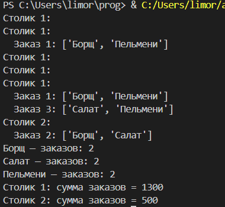
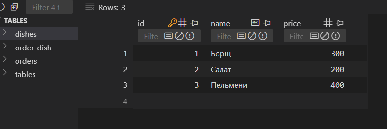

# Отчет

## Условия задачи
Разработать базу данных для учёта заказов в ресторане:
- Каждый заказ принадлежит только одному столику.
- В одном заказе может быть несколько блюд.
- Каждое блюдо может встречаться в нескольких заказах (то есть, связь "многие ко многим" между заказами и блюдами).

## Описание проделанной работы

### 1. Проектирование структуры базы данных

- **Анализ предметной области**: определены основные сущности — столик (`Table`), заказ (`Order`), блюдо (`Dish`).
- **Определение связей**:
    - Один столик может иметь несколько заказов: связь "один ко многим" (`Table` — `Order`).
    - Заказ может содержать несколько блюд, а одно блюдо может входить в разный заказ: связь "многие ко многим" (`Order` — `Dish`).
- **Crow's foot схема**: нарисована схема отношений (см. рисунок ниже), выделена промежуточная таблица для связи заказов и блюд.
- **ER-диаграмма** (crow’s foot notation) была построена (можно нарисовать онлайн на draw.io, dbdiagram.io, или вручную).

### 2. Реализация моделей данных с использованием SQLAlchemy

- **Создан проект на Python**, разбит на модули: `models.py` (модели и схема БД) и `main.py` (заполнение и анализ).
- **Определены SQLAlchemy модели**:
    - `TableInRestaurant` — объект столика с уникальным номером.
    - `Order` — объект заказа, связанный с определённым столиком, поддерживает связь многие-ко-многим с блюдами.
    - `Dish` — блюдо с названием и ценой.
    - Промежуточная таблица `order_dish` реализует связь между заказами и блюдами.
- **Создана и инициализирована база данных** (`restaurant.db`), выполнено автоматическое создание таблиц с помощью `Base.metadata.create_all()`.
- **Заполнены тестовые данные**: добавлены столики, блюда и сами заказы с разными сочетаниями блюд.

### 3. Запросы и анализ данных

- **Сформулированы SQL-запросы на SQLAlchemy ORM**:
    - Посмотреть все заказы для каждого столика.
    - Увидеть, какие блюда были заказаны хотя бы раз и сколько раз каждое.
    - Подсчитать сумму всех заказов отдельно по каждому столику.
- **Каждый запрос реализован отдельным код-блоком, все результаты выводятся удобно для пользователя.**

## Скриншоты результатов

## Ссылки на использованные материалы

- [SQLAlchemy:](https://docs.sqlalchemy.org/)
- **Руководства и примеры:**
    - [Модели и отношения в SQLAlchemy (Metanit)](https://metanit.com/python/database/3.2.php)
    - [Руководство по SQLAlchemy (Skillfactory)](https://blog.skillfactory.ru/rukovodstvo-po-sqlalchemy-v-python/)
    - [Полное руководство по SQLAlchemy (Hexlet)](https://ru.hexlet.io/blog/posts/sqlalchemy-tutorial)
- **Визуализация связей (ERD, crow’s foot):**
    - [Объяснение crow’s foot notation на примерах (Lucidchart)](https://www.lucidchart.com/pages/er-diagrams)
- **Пояснения по организациям проекта на Python:**
    - [Python. Проектная структура (PythonGuide.ru)](https://pythonguide.ru/structures-in-python/)
- **Общие статьи по базам данных:**
    - [Реляционные базы данных — Википедия](https://ru.wikipedia.org/wiki/Реляционная_база_данных)
    - [Отношения в БД (Лекции ИТМО)](https://itmo.ru/ru/viewpage/view/50465/)